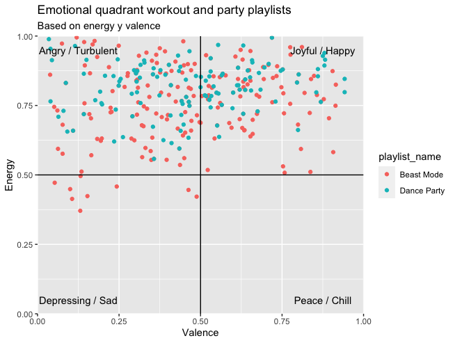
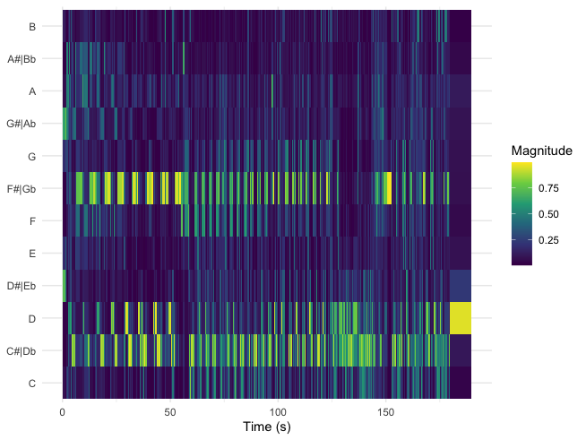

```{r setup}
library(flexdashboard)
library(tidyverse)
library(plotly)
library(spotifyr)
library(ggplot2)
library(shiny)
library(compmus)
library(knitr)
```

# Tempo

## Column 1 {data-width="650"}

### Tempogram Montero vs Element

```{r MONTERO vs Element}
MONTERO <- get_tidy_audio_analysis("3BZEcbdtXQSo7OrvKRJ6mb")
MONTERO %>%
  tempogram(window_size = 8, hop_size = 1, cyclic = FALSE) %>%
  ggplot(aes(x = time, y = bpm, fill = power)) +
  geom_raster() +
  scale_fill_viridis_c(guide = "none") +
  labs(x = "Time (s)", y = "Tempo (BPM)") +
  theme_classic()

Element<- get_tidy_audio_analysis("57BGVV6wcyhbn3hsjlqEZB")
Element %>%
  tempogram(window_size = 8, hop_size = 1, cyclic = FALSE) %>%
  ggplot(aes(x = time, y = bpm, fill = power)) +
  geom_raster() +
  scale_fill_viridis_c(guide = "none") +
  labs(x = "Time (s)", y = "Tempo (BPM)") +
  theme_classic()
```

## Column 2 {data-width="350"}

### Explanation
Montero and Element are the two songs with the highest and lowest tempo in the beast mode playlist. You can see the clear difference between the two

# Lights Out

## Column 1 {data-width="650"}

### Keys

```{r lightsout}
circshift <- function(v, n) {
  if (n == 0) v else c(tail(v, n), head(v, -n))
}

#      C     C#    D     Eb    E     F     F#    G     Ab    A     Bb    B
major_chord <-
  c(   1,    0,    0,    0,    1,    0,    0,    1,    0,    0,    0,    0)
minor_chord <-
  c(   1,    0,    0,    1,    0,    0,    0,    1,    0,    0,    0,    0)
seventh_chord <-
  c(   1,    0,    0,    0,    1,    0,    0,    1,    0,    0,    1,    0)

major_key <-
  c(6.35, 2.23, 3.48, 2.33, 4.38, 4.09, 2.52, 5.19, 2.39, 3.66, 2.29, 2.88)
minor_key <-
  c(6.33, 2.68, 3.52, 5.38, 2.60, 3.53, 2.54, 4.75, 3.98, 2.69, 3.34, 3.17)

chord_templates <-
  tribble(
    ~name, ~template,
    "Gb:7", circshift(seventh_chord, 6),
    "Gb:maj", circshift(major_chord, 6),
    "Bb:min", circshift(minor_chord, 10),
    "Db:maj", circshift(major_chord, 1),
    "F:min", circshift(minor_chord, 5),
    "Ab:7", circshift(seventh_chord, 8),
    "Ab:maj", circshift(major_chord, 8),
    "C:min", circshift(minor_chord, 0),
    "Eb:7", circshift(seventh_chord, 3),
    "Eb:maj", circshift(major_chord, 3),
    "G:min", circshift(minor_chord, 7),
    "Bb:7", circshift(seventh_chord, 10),
    "Bb:maj", circshift(major_chord, 10),
    "D:min", circshift(minor_chord, 2),
    "F:7", circshift(seventh_chord, 5),
    "F:maj", circshift(major_chord, 5),
    "A:min", circshift(minor_chord, 9),
    "C:7", circshift(seventh_chord, 0),
    "C:maj", circshift(major_chord, 0),
    "E:min", circshift(minor_chord, 4),
    "G:7", circshift(seventh_chord, 7),
    "G:maj", circshift(major_chord, 7),
    "B:min", circshift(minor_chord, 11),
    "D:7", circshift(seventh_chord, 2),
    "D:maj", circshift(major_chord, 2),
    "F#:min", circshift(minor_chord, 6),
    "A:7", circshift(seventh_chord, 9),
    "A:maj", circshift(major_chord, 9),
    "C#:min", circshift(minor_chord, 1),
    "E:7", circshift(seventh_chord, 4),
    "E:maj", circshift(major_chord, 4),
    "G#:min", circshift(minor_chord, 8),
    "B:7", circshift(seventh_chord, 11),
    "B:maj", circshift(major_chord, 11),
    "D#:min", circshift(minor_chord, 3)
  )

key_templates <-
  tribble(
    ~name, ~template,
    "Gb:maj", circshift(major_key, 6),
    "Bb:min", circshift(minor_key, 10),
    "Db:maj", circshift(major_key, 1),
    "F:min", circshift(minor_key, 5),
    "Ab:maj", circshift(major_key, 8),
    "C:min", circshift(minor_key, 0),
    "Eb:maj", circshift(major_key, 3),
    "G:min", circshift(minor_key, 7),
    "Bb:maj", circshift(major_key, 10),
    "D:min", circshift(minor_key, 2),
    "F:maj", circshift(major_key, 5),
    "A:min", circshift(minor_key, 9),
    "C:maj", circshift(major_key, 0),
    "E:min", circshift(minor_key, 4),
    "G:maj", circshift(major_key, 7),
    "B:min", circshift(minor_key, 11),
    "D:maj", circshift(major_key, 2),
    "F#:min", circshift(minor_key, 6),
    "A:maj", circshift(major_key, 9),
    "C#:min", circshift(minor_key, 1),
    "E:maj", circshift(major_key, 4),
    "G#:min", circshift(minor_key, 8),
    "B:maj", circshift(major_key, 11),
    "D#:min", circshift(minor_key, 3)
  )

lights_out<-
     get_tidy_audio_analysis("3KcPh8zQrm5YC9gqBEDfOu") %>%
     compmus_align(sections, segments) %>%
     select(sections) %>%
     unnest(sections) %>%
     mutate(
         pitches =
             map(segments,
                 compmus_summarise, pitches,
                 method = "mean", norm = "manhattan"
             )
     )
 lights_out %>% 
     compmus_match_pitch_template(
         key_templates,         # Change to chord_templates if descired
         method = "euclidean",  # Try different distance metrics
         norm = "manhattan"     # Try different norms
     ) %>%
     ggplot(
         aes(x = start + duration / 2, width = duration, y = name, fill = d)
     ) +
     geom_tile() +
     scale_fill_viridis_c(guide = "none") +
     theme_minimal() +
     labs(x = "Time (s)", y = "")
```
## Column 2 {data-width="350"}

### About
Lights out is the song within the Beast mode playlist with the highest energy value

# Beast mode

## Column 1 {data-width="650"}

### Introduction

The corpus I chose for Computational Musicology is playlists with the label "Workout". During covid, I often went to the gym to get out of the house. And if I went to the gym, I always took my phone and Air Pods with me. Music was an essential part of my gym workouts. And I always listen to the label "Workout" on Spotify during my sessions. So, what does it mean to be a "workout" playlist? One thing that interests me is that it needs to give you energy because you are exercising, and you do not want to stop. It needs to help you focus on your movements. And you don't want to get bored or feel the pain from the exercise. Another exciting thing for me is the question, "how does a "workout" playlist distinguish itself from another playlist?". Workout music often has a bumping beat, but party music can also have this, so what is the difference between party music and workout music. And does all the workout music have lyrics or not to keep yourself motivated, or is this not necessary. One should consider the emotions, memories, and associations that different songs evoke. For some people, the extent to which they identify with the singer's emotional state and viewpoint determines how motivated they feel

## Column 2 {data-width="350"}

### Beast mode playlist

<iframe style="border-radius:12px" src="https://open.spotify.com/embed/playlist/37i9dQZF1DX76Wlfdnj7AP?utm_source=generator" width="100%" height="380" frameBorder="0" allowfullscreen="" allow="autoplay; clipboard-write; encrypted-media; fullscreen; picture-in-picture"></iframe>
# The Workout Feeling

## Column 1 {data-width="650"}

### Feelings

```{r picture, echo = F, fig.cap = "Title", out.width = '100%'}

```

## Column 2 {.tabset data-width="350,"}

### Emotional quadrant workout and party playlists

In the figure "Emotional quadrant workout and party playlists" you can see what feeling your party or workout playlists give. Do they convey peace, joy, anger, sadness? We can answer this question by looking at two measures Spotify has established: Valence and Energy.

Defined by Spotify, valence defines it as follows: A measure from 0.0 to 1.0 describing the musical positiveness conveyed by a track. Tracks with high valence sound more positive (e.g. happy, cheerful, euphoric), while tracks with low valence sound more negative (e.g. sad, depressed, angry). On the other hand, energy defines it as follows: Energy is a measure from 0.0 to 1.0 and represents a perceptual measure of intensity and activity. Typically, energetic tracks feel fast, loud, and noisy. For example, death metal has high energy, while a Bach prelude scores low on the scale. Perceptual features contributing to this attribute include dynamic range, perceived loudness, timbre, onset rate, and general entropy.

With these two measurements, you can create a quadrant with a scatter plot that reveals this information. As you can see, each point represents a track from the workout playlist or the party playlist, showing what feeling the track expresses.


### table 2

Possible other plot with different variables

# What is the structure of Legend by Tevez

## Column 1 {.tabset data-width="750"}

### Croma and timber matrices

```{r legend1}
tevez_legend <- 
  get_tidy_audio_analysis("05EG9LwFCVjkoYEWzsrHHO") %>%
  compmus_align(bars, segments) %>%
  select(bars) %>%
  unnest(bars) %>%
  mutate(
    pitches =
      map(segments,
        compmus_summarise, pitches,
        method = "acentre", norm = "manhattan"
      )
  ) %>%
  mutate(
    timbre =
      map(segments,
        compmus_summarise, timbre,
        method = "mean"
      )
  )
bind_rows(
  tevez_legend %>% 
    compmus_self_similarity(pitches, "aitchison") %>% 
    mutate(d = d / max(d), type = "Chroma"),
  tevez_legend %>% 
    compmus_self_similarity(timbre, "euclidean") %>% 
    mutate(d = d / max(d), type = "Timbre")
) %>%
  mutate() %>% 
  ggplot(
    aes(
      x = xstart + xduration / 2,
      width = xduration,
      y = ystart + yduration / 2,
      height = yduration,
      fill = d
    )
  ) +
  geom_tile() +
  coord_fixed() +
  facet_wrap(~type) +
  scale_fill_viridis_c(option = "E", guide = "none") +
  theme_classic() + 
  labs(x = "", y = "")
```

### Unknown

```{r picture1, echo = F, fig.cap = "Title", out.width = '100%'}

```

## Column 2 {data-width="250"}

### Explanation
The two self-similarity matrices at the right, each summarised at the bar level but with axes in seconds, illustrate pitch- and timbre-based self-similarity within Legend by Tevez. 

# Normal vs remix

## Column 1 {data-width="800"}

### Trust Nobody by DJ Snake
```{r trust nobody}
trust_nobody_normal <- get_tidy_audio_analysis("08bDGEzsYd9ebCc7p23X4j") %>%
      select(segments) %>%
      unnest(segments) %>%
      select(start, duration, pitches)

trust_nobody_remix_valentino_khan <- get_tidy_audio_analysis("52wqMbmCqeTw37jd4zFAWr") %>%
      select(segments) %>%
      unnest(segments) %>%
      select(start, duration, pitches)

compmus_long_distance(
  trust_nobody_normal %>% mutate(pitches = map(pitches, compmus_normalise, "chebyshev")),
  trust_nobody_remix_valentino_khan %>% mutate(pitches = map(pitches, compmus_normalise, "chebyshev")),
  feature = pitches,
  method = "aitchison"
) %>%
  ggplot(
    aes(
      x = xstart + xduration / 2,
      width = xduration,
      y = ystart + yduration / 2,
      height = yduration,
      fill = d
    )
  ) +
  geom_tile() +
  coord_equal() +
  labs(x = "Trust nobody", y = "Trust Nobody Valentino Khan Remix") +
  theme_minimal() +
  scale_fill_viridis_c(guide = NULL)
```

## Column 2 {data-width="200"}

### Explanation
The visualisation of two performances of the song Trust Nobody by DJ Snake. The one on the x-axis is the original one, and the one on the y-axis is the Remix version by Valentino Khan.
The visualisation uses the Aitchison distance between chroma features to show how the two performances align.

The remix version already starts a bit faster. Therefore, the beat drop of the remix is already at 00:49, while the beat drop in the original is 14 seconds later, at 01:03. 

On Khan's remix version, hardstyle anticipation masquerades as a break after a haunting build. This lure eventually gives way to a double-build that falls on some pseudo-dubstep with gritty talking synths and hard-hitting percussion elements. Khan's remix adds a level of grit and sound design to the original that takes its energy to a darker stratosphere.

# Conclusion

## Column {data-width="1000"}

### Conclusion 

No conclusion yet, working on it;)

## Hallo {data-width="500"}

## Hallo1 {data-width="500"}
